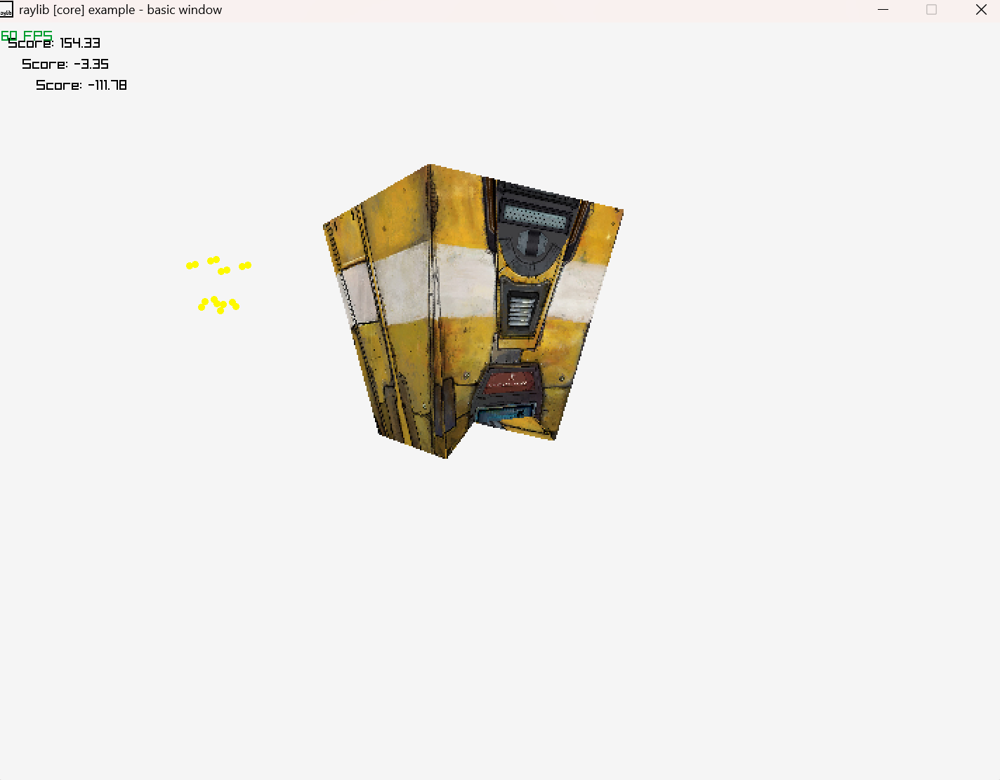

# Tiny Software Renderer
A real-time 3D visualization engine built from scratch in C using [Raylib](https://www.raylib.com/), designed to render custom 3D objects based on user input. The renderer simulates key aspects of modern graphics pipelines — including object transformation, rasterization, Z-buffering, and texture mapping — all without relying on GPU hardware acceleration.
 ## Features

- **Real-Time 3D Rendering:** Visualize user-defined objects dynamically with interactive control over position, rotation, and velocity.
- **Multithreaded Performance:** Utilizes OpenMP for parallel processing, enabling smoother real-time rendering.
- **OBJ Mesh Import:** Supports triangulated `.obj` files with texture mapping for loading custom models into memory.
- **Z-Buffer Implementation:** Ensures correct depth handling for overlapping surfaces.
- **Perspective-Correct Texture Mapping:** Uses barycentric coordinates for accurate per-pixel UV interpolation.
- **User Input Handling:** Transform and interact with rendered objects using keyboard/mouse inputs.
- **Mathematics-Driven Engine:** Employs vector algebra, matrix transformations, projection, and camera logic to replicate 3D perspective.

---

## Technical Highlights

- **Language:** C (C99)
- **Rendering Backend:** Raylib (used for windowing, drawing, and input)
- **Parallelism:** OpenMP for multi-threaded rasterization
- **Model Loading:** Custom-built OBJ parser for mesh and texture import
- **Graphics Pipeline:** Software-implemented vertex transformation, rasterization, depth buffering, and shading

---

## Demo

---
### Prerequisites
- C Compiler (GCC or Clang)
- [Raylib](https://www.raylib.com/) installed
- OpenMP support enabled in your compiler

